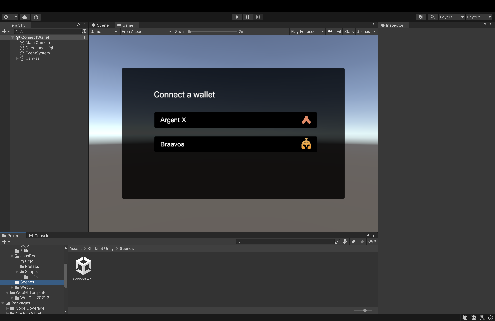
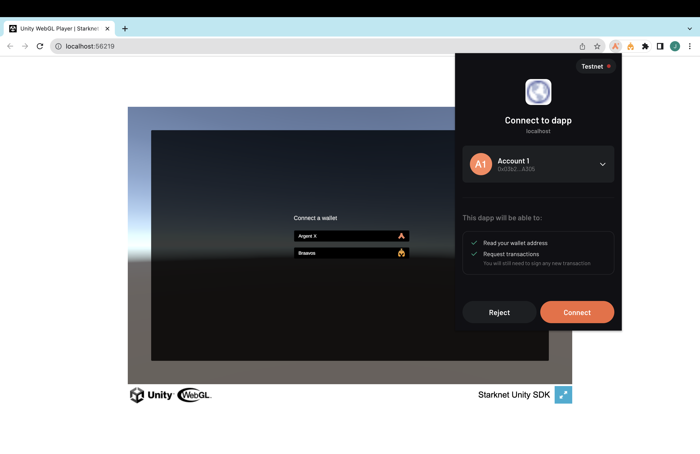

# Getting Started

## Install a Starknet Wallet

You will need to install a Starknet wallet in order to develop a Starknet-enabled game. We recommend using the [Argent wallet](https://www.argent.xyz/) or the [Braavos wallet](https://braavos.app/).

## Download the Starknet Unity SDK

In order to install `starknet.unity` into your Unity project, you must first download the `starknet.unitypackage` package. You can download the [latest release](https://github.com/NethermindEth/starknet.unity/releases) directly from this [download link](https://github.com/NethermindEth/starknet.unity/releases/latest/download/starknet.unitypackage).


## Create a Unity Project

Create a new Unity project or open an existing one. We recommend using Unity 2021.3.0 or later.


## Import the Starknet Unity SDK

Import the `starknet.unitypackage` package into your Unity project. You can do this manually through `Assets -> Import Package -> Custom Package` or by dragging it into the `Assets` folder in Unity editor.


Make sure you import all of the files in the package.


After importing the package, you should see a popup dialogue that prompts you to select your preferred game engine and enter your RPC URL. If you are building on Dojo, you'll also be asked to enter the world address.

In case you don't see this dialogue, you can always open it manually by going to `Starknet SDK -> Setup`.


## Import Newtonsoft.JSON

Newtonsoft’s Json.NET Package is required to use the SDK successfully.

Go to `Windows -> Package Manager`. Once the Package Manager window opens, go to `Add package from git URL`, type `com.unity.nuget.newtonsoft-json` then click **Add**.

## Connect to a Starknet Wallet

You can now enable players to connect to their Starknet wallets. Get started with the ConnectWallet sample scene by going to `Starknet Unity -> Scenes -> ConnectWallet`.



## Build and Run

Go to the build settings and switch the platform to WebGL. Then, go to Player Settings and uncheck the Auto Graphics API in `Other Settings`. This will make sure that the WebGL build will use WebGL 2.0.


Select the appropriate WebGL template as shown below.


Finally, build and run the project. You should now be able to connect to a Starknet wallet.



## Calling a Starknet Contract

### WebGL

You can call a Starknet contract by using the `CallContract` function. This function takes in the contract address, the method name, the calldata, the name of the class that will handle the response, and the name of the callback function.

```csharp
// This example shows how to check the ERC721 token balance of an address.
using System.Globalization;
using System.Numerics;
using UnityEngine;
using Utils;

public class Erc721Balance : MonoBehaviour
{
    public void BalanceOf()
    {
        string userAddress = "USER_ADDRESS";
        string contractAddress = "CONTRACT_ADDRESS";

        string[] calldata = new string[1];
        calldata[0] = userAddress;
        string calldataString = JsonUtility.ToJson(new ArrayWrapper { array = calldata });
        JSInteropManager.CallContract(contractAddress, "balanceOf", calldataString, "Erc721Balance", "Erc721Callback");
    }

    public void Erc721Callback(string response)
    {
        JsonResponse jsonResponse = JsonUtility.FromJson<JsonResponse>(response);
        BigInteger balance = BigInteger.Parse(jsonResponse.result[0].Substring(2), NumberStyles.HexNumber);
        Debug.Log(balance);
    }
}
```

### RPC

```csharp
using UnityEngine;
using System.Collections;
using StarkSharp.Platforms.Unity.RPC;
using StarkSharp.Connectors.Components;
using StarkSharp.Settings;

public class Balance : MonoBehaviour
{
    public void CheckUserBalance()
    {
        Settings.apiurl = PlayerPrefs.GetString("RPCNode");
        string selector = "balanceOf";
        string userAddress = "USER_ADDRESS";
        string contractAddress = "CONTRACT_ADDRESS";

        UnityRpcPlatform rpcPlatform = new UnityRpcPlatform();
        ContractInteraction contractInteraction = new ContractInteraction(contractAddress, selector, userAddress);
        rpcPlatform.CallContract(contractInteraction, OnSuccess, OnError);
    }

    void OnSuccess(string result)
    {
        Debug.Log("Contract call successful: " + result);
    }

    void OnError(string error)
    {
        Debug.LogError("Contract call error: " + error);
    }
}
```

## Sending a Transaction

### WebGL

You can send a transaction to a Starknet contract by using the `SendTransaction` function. This function takes in the contract address, the method name, the calldata, the name of the class that will handle the response, and the name of the callback function.

```csharp
using System.Collections;
using System.Collections.Generic;
using UnityEngine;
using Utils;

public class Mint : MonoBehaviour
{
    public void MintToken()
    {
        string recipientAddress = "RECIPIENT_ADDRESS";
        string contractAddress = "CONTRACT_ADDRESS";

        string[] calldata = new string[] {
            recipientAddress
        };
        string calldataString = JsonUtility.ToJson(new ArrayWrapper { array = calldata });
        JSInteropManager.SendTransaction(contractAddress, "mint", calldataString, "Erc721Mint", "MintCallback");
    }

    public void MintCallback(string transactionHash)
    {
        Debug.Log("https://goerli.voyager.online/tx/" + transactionHash);
    }
}
```

### RPC

```csharp
// This example shows how to transfer tokens from one address to another.
{
    void Start()
    {
        string functionName = "transfer";
        string senderAddress = "SENDER_ADDRESS";
        string contractAddress = "CONTRACT_ADDRESS";
        string recipientAddress = "RECIPIENT_ADDRESS";
        string amount = "0x5af3107a4000" // 100000000000000 WEI in hex
        string[] functionArgs = new string[] { recipientAddress, amount, "0x0" }; // argument of Uint256 type are padded with 0x0. Hence, the third argument
        CairoVersion cairoVersion = CairoVersion.Version1; // can also be CairoVersion.Version0 for legacy contracts
        string maxFee = "0xa2d9d3b14c"; // use any value. maxFee will be calculated automatically
        string chainId = "0x534e5f474f45524c49"; // SN_GOERLI
        string privateKey = "YOUR_PRIVATE_KEY";

        // Send transaction is defined in `Assets/Starknet Unity/Rpc/Scripts/Transaction/SendTransaction.cs`
        SendTransaction.Send(senderAddress, contractAddress, functionName, functionArg, cairoVersion, maxFee, chainId, privateKey, version);
    }
}
```
