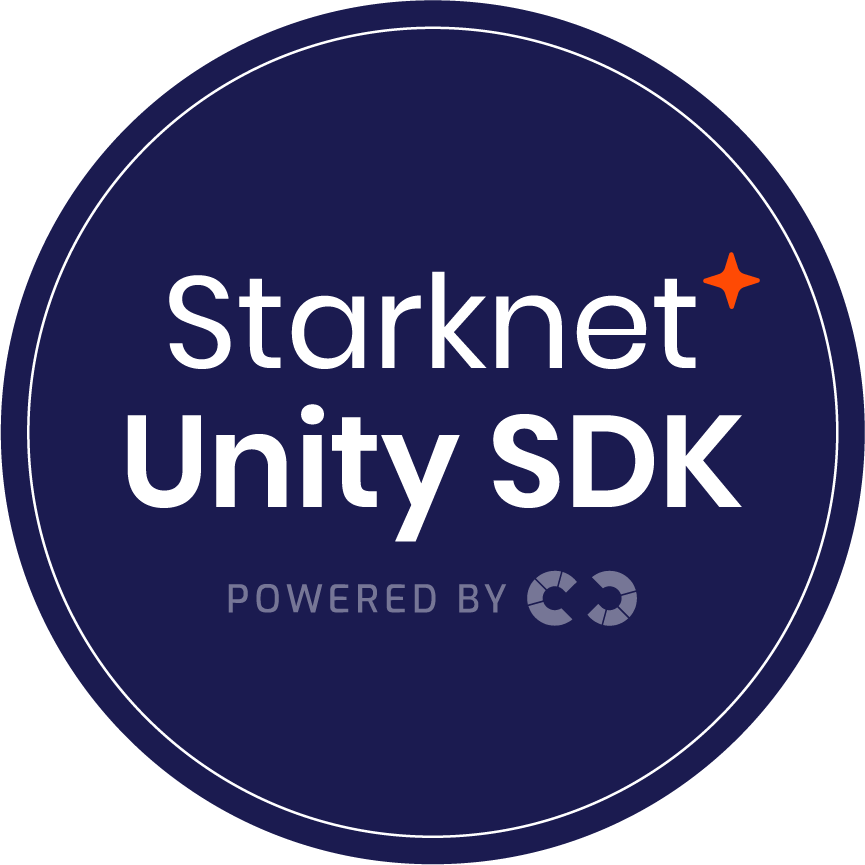

  
   

# Starknet Unity SDK

Starknet Unity SDK lets game developers integrate Starknet blockchain functionality into their Unity projects with ease.

## Features

- Easy integration with Unity projects.
- Seamless connection to the Starknet blockchain.
- Argent and Braavos wallet support.
- Tools for querying balances, sending transactions, and interacting with smart contracts.
- Dojo Engine Support

## Installation

1. Download the [latest release](https://github.com/NethermindEth/starknet.unity/releases) from this repository.
2. Import the package into your Unity project.
3. Follow the integration instructions provided in our [documentation](Docs/Documentation.md).
